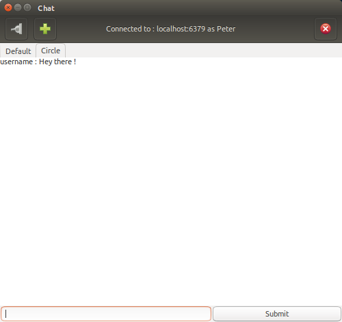

# RedisChat

RedisChat enable you to **chat** / **monitor** with multiples rooms on a redis server with a graphical user interface or not



### Get It Working
1. Go in src
2. Launch a terminal and type 

```bash
python3 MainWindow.py
```
ou
```bash
./MainWindow.py
```
3. Connect to a server
4. Add a channel
5. Start chating

## Folders
* src : sources of the project
* dist : executable of the project (TODO)

### Files
* MainWindow : The main window with gtk
* DialogMessage : The dialog window for connection, add a channel and errors messages
* ThreadMessage : Launch anothor thread to receive messages
* RedisServer : Connect to the server, send, receive, subscribe, ...

### Imports
* Redis
* GTK3

### TODO
* Allow the user to choose 2 mods chat or monitoring
* Catch connection lost
* Check if we have already subscribe to a channel we try to add
* Disconnection close the tab ?
* Put color on the username
* Press enter to validate dialog window
* Save the connection details
* Change wrapline following the size of the window
* Speed up the thread and allow to choose
* Accents in username, channel name and host crash the programme
* Allow the program to be run in command line and monitor multiples channels
